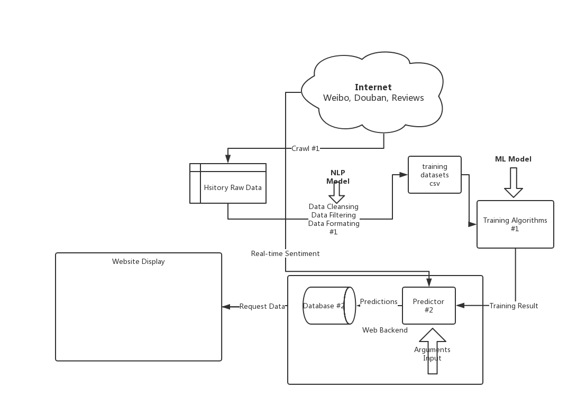

# Box Office Predictor
A project of box office predictor for EIE3280 in CUHKSZ.

## Reference

- [Prediction of Movie Success using Sentiment
Analysis of Tweets](http://www.jscse.com/papers/vol3.no3/vol3.no3.46.pdf)

- [Dynamic Box Office Forecasting Based on Microblog Data](https://www.jstor.org/stable/pdf/24899494.pdf?refreqid=excelsior%3Aa3a89bc298c2c0a9c141ce4b02f3cead)

## Baseline Structure 

## Predictor
Here we wanna train a predictor to predict the box office by using the data in the following:

Total BO | Director Average | Main Role i Average  | Sentiment Index | Movie Type
:-: | :-: | :-: | :-: | :-: 
int | int | int | float | vector |

### NLP tools
[Awesome Chinese NLP](https://github.com/crownpku/Awesome-Chinese-NLP)

## Plotly Dash Application
Here we wanna build a dash application for the visualization of the predictions.
### Materials
- [Dash Tutorial](https://pythonprogramming.net/data-visualization-application-dash-python-tutorial-introduction/)
- [Dash Official Doc](https://dash.plot.ly/)
